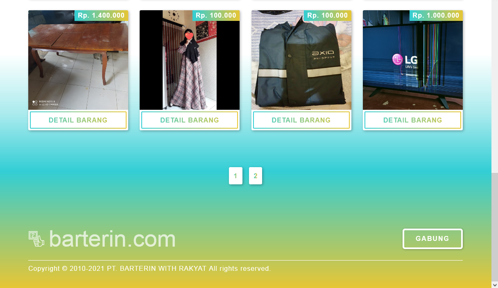
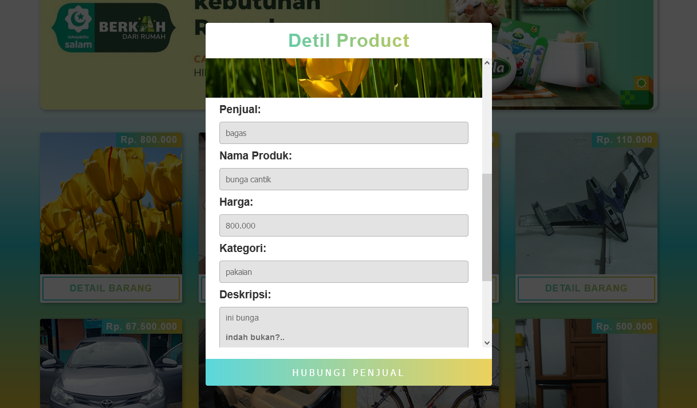
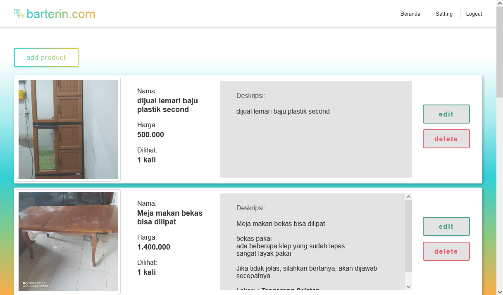
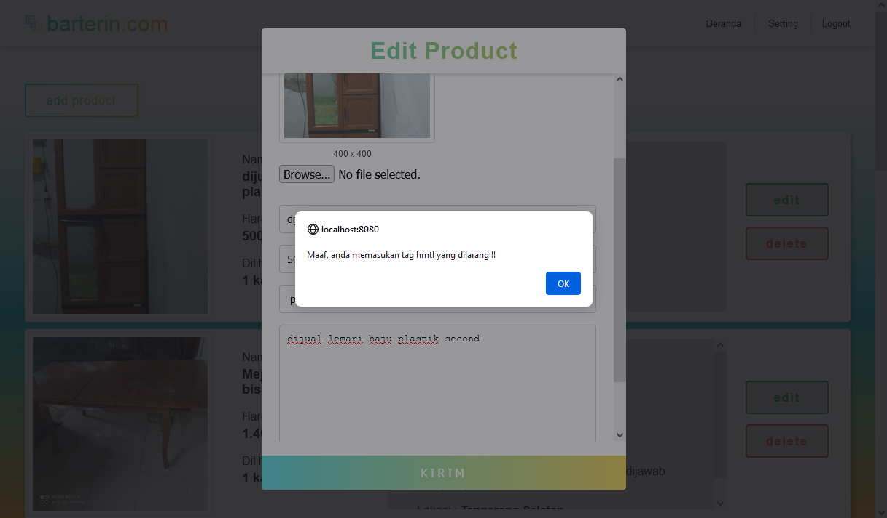
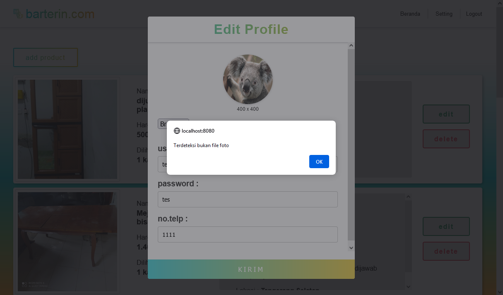
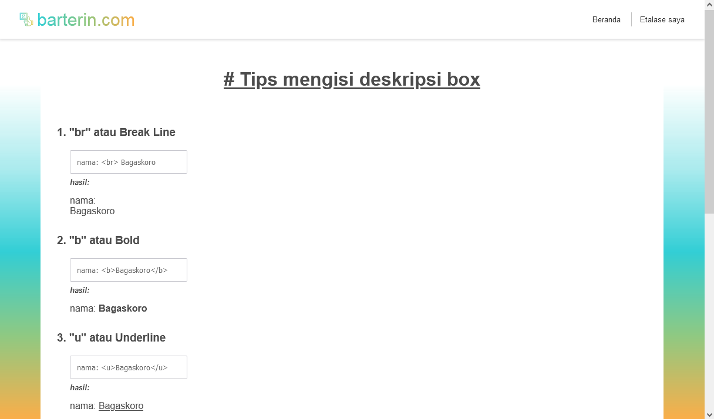

# My case study in learning crud on java

## Tools & Stack
- [x] Netbeans
- [x] PhpMyadmin
- [x] Tomcat
- [x] Java (Java Server Page)
- [x] glide.js

## Features
* User Dashboard
* product statistic

## Screenshoot
Live Demo Available Soon, Insya Allah   
> HOME
>   

> FOOTER
>   

> DETIL PRODUCT
>   

> LOGIN
>   

> DASHBOARD
>   

> Validation
>   
>   

> FAQ
>   